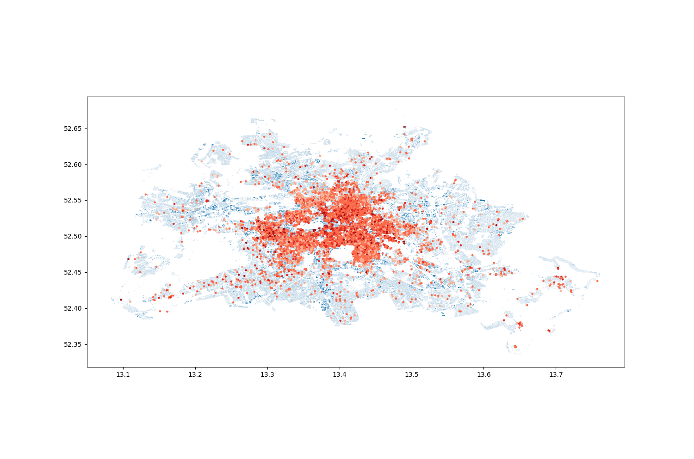

# Motivation

We will explore Airbnb data using geopandas. Property locations will be marked over a base map of Berlin. I got inspired by [this post](https://towardsdatascience.com/geopandas-101-plot-any-data-with-a-latitude-and-longitude-on-a-map-98e01944b972).

# Data

The `listings.csv` file (3.57 MB) we will work with can be downloaded from [Inside Airbnb](http://data.insideairbnb.com/germany/be/berlin/2019-07-11/visualisations/listings.csv). It consists of 24437 records of airbnb listings in Berlin, compiled on 11 July, 2019. Please place it in the '../data/csv' folder.

For the shape file, I downloaded `berlin-latest-free.shp.zip` (298 MB) from [geofabrik](http://download.geofabrik.de/europe/germany/berlin.html) and unzipped the contents under `../data/shp/`.

# Geopandas

Geopandas [Documentation](http://geopandas.org/index.html).

For the instalation, I created a new conda environment:

```shell
conda create -n geo_env python=3.7.4
conda activate geo_env
conda config --env --add channels conda-forge
conda config --env --set channel_priority strict

conda install pandas fiona shapely pyproj rtree
pip install git+git://github.com/geopandas/geopandas.git
```

When `import geopandas as gpd`, I got `OSError: Could not find lib geos_c.dll or load any of its variants`, so, following [this suggestion](https://github.com/conda-forge/shapely-feedstock/issues/55#issuecomment-529308668), I downgraded a couple of packages by: `conda install shapely==1.6.3 --channel conda-forge`.

Finally, I also installed matplotlib: `conda install matplotlib` and descartes for plotting polygons in geopandas: `conda install descartes`.

# Airbnb property locations

With this [script](../scripts/airbnb_geopandas.py) I was able to generate the figure , which marks the airbnb house/apartments locations in Berlin. The darker points correspond to more expensive properties, up to 200 €/night.
